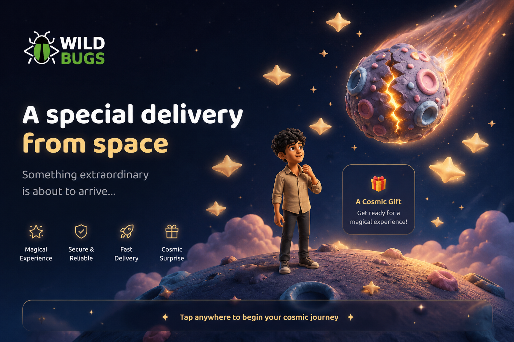

# 🎁 Asteroid Proposal Template
<p align="center">
  
</p>

A magical, interactive, claymorphic space-themed proposal web application. This template is designed as an out-of-this-world way to pop the question, or simply to create a beautiful, engaging interactive card! 

## Hosted URL : https://astroid-page-b7so.vercel.app/

## ✨ Features

- **Interactive Animations:** A stunning sequence where a falling asteroid cracks open to reveal a hidden ring box.
- **Claymorphism Design:** Beautiful glassmorphic and clay-styled UI elements.
- **Particle Systems:** Custom-built ambient particles including stardust, sparkles, and a celebratory confetti burst when accepted!
- **Media Sync Template:** Built-in template structure for synchronizing background audio and video (ready to be uncommented and linked to your own media files).
- **The "Unrejectable" Mechanic:** An evasive "Not yet" button that dynamically dodges the cursor/touch to ensure you always get a "Yes!".
- **Mobile Responsive:** Works seamlessly on desktop and mobile devices.

## 🚀 Getting Started

1. **Clone the Repository:**
   ```bash
   git clone <your-repo-url>
   ```

2. **Run Locally:**
   You can serve this folder using any local web server (e.g., Live Server in VSCode, Python's `http.server`, etc.).
   ```bash
   python -m http.server
   ```
   Then open `http://localhost:8000` in your browser.

3. **Customize:**
   - **Text:** Open `index.html` and modify the text inside the `<div id="text-card">` to your liking.
   - **Media:** Uncomment the `<div class="media-container">` in `index.html` and add paths to your own `.mp4` or `.mpeg` files. The JavaScript in `script.js` handles syncing audio with the video loop!
   - **Assets:** Replace the `.png` files in the `Assets/` folder to customize the characters, asteroid, or backgrounds.

## 🛠️ Built With

- **HTML5 & CSS3:** Pure CSS deep-space gradients, glassmorphism, and responsive layouts.
- **Vanilla JavaScript:** State machine logic, Web Animations API (WAAPI), proximity dodge physics, and canvas rendering.

## 📄 License

This project template is open-sourced and available for use within the organization.
